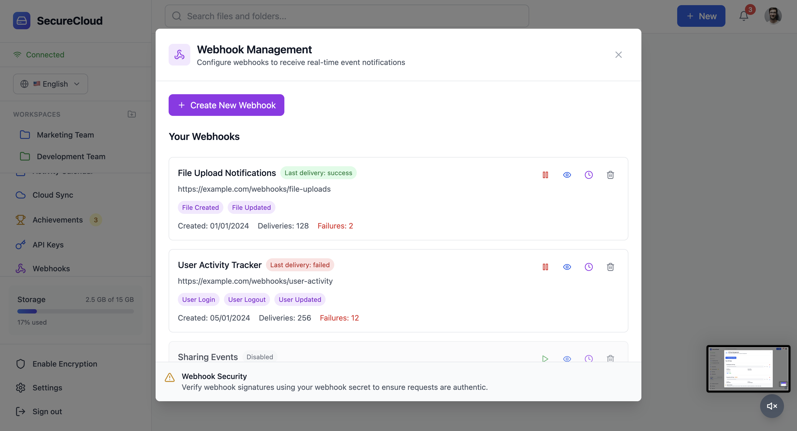

# ☁️ SecureCloud – Secure File Storage & Sharing System

SecureCloud is a full-stack, production-grade cloud storage system — your personal Google Drive alternative. With robust file management, secure sharing, smart AI search, real-time collaboration, and enterprise-grade features like version control and audit logging, it offers an intuitive, secure, and lightning-fast user experience.

🌐 **Live Demo**: [https://securecloud-app.vercel.app](https://securecloud-app.vercel.app)

---

## 🚀 Features

### 📁 File & Folder Management
- Drag & Drop File Uploads with real-time progress
- Multi-select operations: move, rename, copy, delete
- Create nested folders and navigate via breadcrumbs
- Starred files & folders for quick access
- Soft delete with Trash system (30-day retention & restore)

### 🔐 Secure Sharing & Permissions
- Generate secure public share links
- Password protection & expiration settings
- View/download tracking on shared files
- Role-based access control (Viewer, Editor)
- One-click revoke access with audit trail

### 🔄 File Versioning System
- Auto version creation on file update
- Interactive version timeline with change logs
- AI-generated version summaries and diff analysis
- Restore or preview any previous version
- Side-by-side visual comparison with change highlighting

### 🧠 AI-Powered Features
- 🔍 **Smart Search**: Natural language and semantic search (e.g. "Find invoices from March")
- 🏷️ **Auto Tagging**: AI suggests tags/folders on upload
- 📄 **Smart Document Parsing**: Extracts metadata from PDFs, invoices, receipts, etc.
- 💡 **AI Insights**: Suggests file cleanup or categorization

### 🧑‍💻 Real-time Collaboration
- Inline commenting with threads, avatars & timestamps
- User presence indicator (who’s viewing/editing)
- Typing & cursor position indicators
- Real-time updates using WebSockets

### 📊 Usage Analytics & Activity Logs
- Storage usage breakdown (per file type, per folder)
- Upload/download stats by day/week/month
- User activity calendar & audit trail
- Real-time collaboration analytics

### 🧑‍🏫 Workspaces & Team Access
- Create teams with shared storage
- Role-based team permissions (Admin, Editor, Viewer)
- Shared workspaces and private folders
- Workspace analytics dashboard

### 🧩 Advanced Integrations
- Multi-cloud sync (Google Drive, Dropbox, OneDrive)
- Webhook system for external automation
- API Key Management & OAuth 2.0 Integration

### 🛡️ Security & Compliance
- Zero-Knowledge Encryption for select folders/files
- Client-side AES encryption with passphrase
- GDPR tools: Export your data, retention policies
- Secure login with JWT & 2FA-ready hooks

### ⚙️ User Settings & Preferences
- Avatar upload, theme settings, and language preferences
- Text-to-speech support for accessibility
- Color-blind mode & keyboard shortcuts
- Notification preferences (email, in-app)

---

## 📸 Screenshots

---

## 🛠 Tech Stack

### Frontend
- React 18 + TypeScript + Tailwind CSS
- Zustand for state management
- Framer Motion, React Hook Form, React Router

### Backend
- Node.js + Express
- MongoDB + Mongoose
- REST APIs + WebSockets
- Stripe (for subscription tiers)

### AI Features
- GPT-4 powered search and summaries
- Natural Language Search
- Smart metadata extraction from documents

### DevOps
- Vercel + Render (Deployment)
- JWT Authentication
- CORS, Helmet, Rate Limiting
- Webhook verification and Stripe security

---

## 📁 Project Structure

